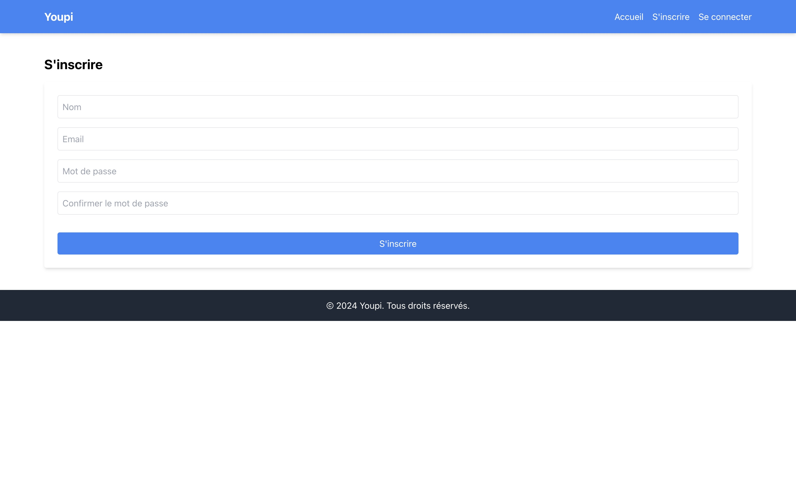

# youpi-frontend

# j'essaye de présenter l'app ici

## j'ai du faire quelques capture d'ecrac
 

pour les acces 

<strong>niass@gmail.com</strong>

<strong>password</strong>

`c'est l'utilisateur qui a plus de taches`

la base de donnée c'est djà en ligne j'utilise directement une base donnée en ligne gratuite donc vous pouvez test sans soucis

